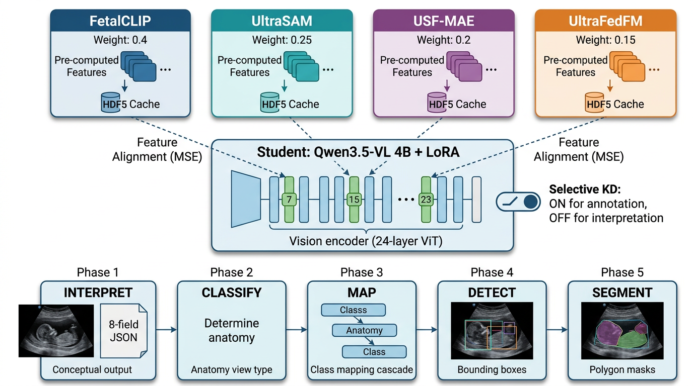

<div align="center">

# FADA: Knowledge-Distilled Vision-Language Models for Accessible Fetal Ultrasound Interpretation in Low-Resource Obstetric Settings

[](LICENSE)
[](#citation)
[](https://huggingface.co/spaces/mshz88/fada-ultrasound-vlm)
[](https://huggingface.co/mshz88/FADA-SKD-4B)
[](https://doi.org/10.5281/zenodo.20104811)

</div>

---

## Overview

**FADA** (Fetal Anatomy Delineation and Analysis) is a unified Vision-Language Model (VLM) that performs five fetal ultrasound tasks -- interpretation, classification, anatomical mapping, object detection, and segmentation -- within a single end-to-end pipeline. We introduce **Selective Knowledge Distillation (SKD)**, which transfers task-specific expertise from four specialized teacher models (FetalCLIP, UltraSAM, USF-MAE, UltraFedFM) into a compact student VLM while preserving critical clinical reasoning capabilities.

FADA is designed for deployment in **low- and middle-income countries (LMICs)** where access to trained sonographers is limited. The system enables task-shifting from specialist sonographers to general health workers with AI-assisted interpretation, aligned with UN Sustainable Development Goals 3 and 10.

---

## Key Results

### Automated Evaluation (4,478 test samples)

| Model | mAP@0.50 | mAP@0.75 | Dice | IoU | Cls Acc |
|:------|:--------:|:--------:|:----:|:---:|:-------:|
| **FADA-Base (4B)** | **0.7798** | 0.4211 | 0.8813 | 0.8133 | 0.8225 |
| **FADA-SKD (4B)** | 0.7671 | 0.4402 | **0.8820** | **0.8149** | 0.8379 |
| **FADA-FKD (4B)** | 0.7695 | **0.4576** | 0.8790 | 0.8114 | **0.8296** |
| **FADA-Base (0.8B)** | **0.6885** | **0.3817** | 0.8625 | 0.7899 | 0.8375 |
| **FADA-SKD (0.8B)** | 0.6744 | 0.3756 | **0.8662** | **0.7921** | **0.8433** |

### Expert Sonographer Evaluation (237 images, 1=best, 3=worst)

| Model | Annotation Score | Interpretation Score | Overall |
|:------|:----------------:|:--------------------:|:-------:|
| FADA-Base (4B) | 2.017 | 2.110 | 2.063 |
| **FADA-SKD (4B)** | 2.025 | **1.924** | **1.975** |
| FADA-FKD (4B) | 2.051 | 2.181 | 2.116 |

### Human-in-the-Loop Evaluation (49 clinical cases, FADA-SKD only)

| Task | Mean Score | Score 1 (%) | Score 2 (%) | Score 3 (%) |
|:-----|:----------:|:-----------:|:-----------:|:-----------:|
| Interpretation | **1.286** | 73.5 | 24.5 | 2.0 |
| Annotation | 1.449 | 63.3 | 28.6 | 8.2 |

> FADA-SKD achieves 73.5% perfect interpretation scores (Score=1) in human-in-the-loop deployment mode.

---

## Architecture



FADA operates through a **5-phase inference pipeline**:

1. **Interpret** -- Generate structured 8-field JSON clinical interpretation
2. **Classify** -- Identify the anatomical plane/view category
3. **Map** -- Map anatomical structures to detection/segmentation targets
4. **Detect** -- Localize structures with bounding boxes
5. **Segment** -- Produce pixel-level segmentation masks

### Selective Knowledge Distillation

The key innovation is **Selective KD (SKD)**: feature-level alignment from teacher models is applied *only* to annotation data (detection, segmentation, classification), while interpretation data trains with standard supervised fine-tuning alone. This preserves the student's clinical language generation capabilities while benefiting from teachers' spatial expertise.

**Teacher ensemble:**
- **FetalCLIP** (weight=0.40): Contrastive VL pre-training on fetal ultrasound
- **UltraSAM** (weight=0.25): Segment Anything adapted for ultrasound
- **USF-MAE** (weight=0.20): Self-supervised MAE across 43 ultrasound datasets
- **UltraFedFM** (weight=0.15): Federated foundation model across institutions

---

## Quick Start

### Installation

```bash
pip install torch transformers peft accelerate pillow
```

### Inference

```python
import torch
from transformers import Qwen2_5_VLForConditionalGeneration, AutoProcessor
from peft import PeftModel

# Load base model
model = Qwen2_5_VLForConditionalGeneration.from_pretrained(
    "Qwen/Qwen2.5-VL-3B-Instruct",
    torch_dtype=torch.float16,
    device_map="auto"
)

# Load FADA-SKD LoRA adapter
model = PeftModel.from_pretrained(model, "mshz88/FADA-SKD-4B")
processor = AutoProcessor.from_pretrained("Qwen/Qwen2.5-VL-3B-Instruct")

# Prepare input
messages = [
    {"role": "user", "content": [
        {"type": "image", "image": "path/to/ultrasound.png"},
        {"type": "text", "text": "Interpret this fetal ultrasound image."}
    ]}
]

text = processor.apply_chat_template(messages, tokenize=False, add_generation_prompt=True)
inputs = processor(text=[text], images=[image], return_tensors="pt").to(model.device)

# Generate
output = model.generate(**inputs, max_new_tokens=512)
response = processor.decode(output[0], skip_special_tokens=True)
print(response)
```

---

## Dataset

| Source | Images | Tasks | Categories |
|:-------|:------:|:-----:|:-----------|
| Custom Interpretation | 56,805 | Interpretation | 14 anatomical views |
| FPUS23 | 11,398 | Classification | 6 fetal pose classes |
| FUSEP | ~3,000 | Detection | 14 brain structures |
| Fetal_Head | 1,334 | Segmentation | Brain, CSP, LV |
| CRL_NT | 5,481 | Detection/Segmentation/Keypoint | CRL, NT, Scale bars |
| FOCUS | 1,500 | Detection | Cardiac structures |
| Fetal Abdominal Structures | ~700 | Segmentation | Artery, vein, liver, stomach |
| Fetal Echocardiography | ~1,200 | Classification | 5 cardiac view classes |

> The interpretation dataset and evaluation materials are available on [Zenodo](https://doi.org/10.5281/zenodo.20104811) (access upon request during review).

---

## Training

| Parameter | Value |
|:----------|:------|
| Base Model | Qwen2.5-VL-3B-Instruct (4B variant) |
| Adaptation | LoRA (r=16, alpha=16) |
| Epochs | 3 |
| Batch Size | 2 (gradient accumulation: 4) |
| Learning Rate | 2e-4 |
| Hardware | Single NVIDIA RTX 4090 (24GB VRAM) |
| Training Time | ~40 hours per variant |

```bash
# Train FADA-SKD (Selective Knowledge Distillation)
python training/train_skd.py

# Train FADA-FKD (Full Knowledge Distillation)
python training/train_fkd.py

# Train FADA-Base (no distillation)
python training/train_base.py
```

---

## Evaluation

```bash
python evaluation/evaluate.py \
    --model_path mshz88/FADA-SKD-4B \
    --data_dir data/ \
    --output_dir eval_results/
```

---

## Project Structure

```
FADA/
├── README.md
├── LICENSE
├── requirements.txt
├── training/          # Training scripts
│   ├── train_skd.py   # Selective Knowledge Distillation
│   ├── train_fkd.py   # Full Knowledge Distillation
│   ├── train_base.py  # Baseline (no KD)
│   └── configs/       # Training configurations
├── evaluation/        # Evaluation pipeline
│   ├── evaluate.py
│   └── metrics/       # Detection, segmentation metrics
├── inference/         # Inference scripts
│   ├── infer.py
│   └── test_e2e_inference.py
├── data/              # Data preparation
│   ├── prepare_data.py
│   └── prepare_interpret_data.py
├── webapp/            # HuggingFace Spaces demo app
├── losses/            # KD loss functions
├── models/            # Model architecture & hooks
└── figures/           # Architecture diagrams
```

---

## Links

| Resource | Link |
|:---------|:-----|
| **Web Demo** | [HuggingFace Spaces](https://huggingface.co/spaces/mshz88/fada-ultrasound-vlm) |
| **Model Weights** | [HuggingFace](https://huggingface.co/mshz88/FADA-SKD-4B) *(available upon request)* |
| **Dataset** | [Zenodo](https://doi.org/10.5281/zenodo.20104811) *(available upon request)* |
| **Paper** | Submitted to *npj Digital Medicine* |
| **Project Page** | [GitHub Pages](https://mahmoodphd.github.io/FADA/) |

---

## Citation

```bibtex
@article{fada2026,
  title={FADA: Knowledge-Distilled Vision-Language Models for Accessible Fetal Ultrasound Interpretation in Low-Resource Obstetric Settings},
  author={Alzubaidi, Mahmood and Al Maadeed, Somaya and Bouridane, Ahmed},
  journal={npj Digital Medicine},
  year={2026},
  note={Under review}
}
```

---

## Acknowledgments

This work has been funded by:
- **IDRC** (International Development Research Centre), Grant 110060-001
- **QRDI** (Qatar Research, Development and Innovation Council), Grant PPM 07-0409-240041

We gratefully acknowledge the expert sonographers who contributed their time to clinical validation, and the open-source fetal ultrasound dataset communities whose shared resources made this work possible.

---

## License

This project is licensed under the [Apache License 2.0](LICENSE).

